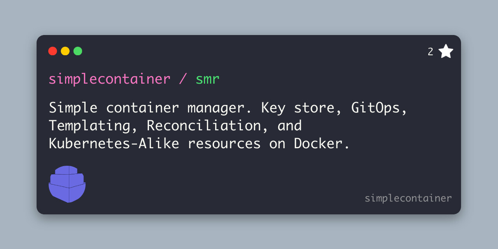

Quick start
===========

> [!WARNING]
> The project is not stable yet. Releases and major changes are introduced often. 

This is a quick start tutorial for getting a simple container up and running.

## Description
A simple container manager is designed to ease life for the developers and DevOps engineers running containers on Docker.

Introducing objects which can be defined as YAML definition and sent to the simplecontainer manager to produce Docker container via reconciliation:

- Containers
- Container
- Configuration
- Resource
- Gitops
- CertKey
- HttpAuth

These objects let you manage Docker containers with configure features:

- Single Docker daemon / Cluster of Docker daemons
- Overlay networking using flannel
- Integrated DNS server isolated from Docker daemon
- GitOps: deploy objects from the GitOps repositories
- Replication of containers in cluster of Docker daemons
- Reconciliation and tracking the lifecycle of the Docker containers
- CLI to interact with the simplecontainer
- Fast learning curve - simplicty and deterministic behavior
- Reliable dependency ordering and readiness probes
- Recreate containers from the KV store in case of failure
- Templating of the container objects to leverage secrets and configuration


Installation of the agent
-------------------------
To start using simple container first run it to generate smr project and build configuration file.

Example provided is for Docker platform which is only currently supported. 

Future platforms to be included:
- Podman

Installation of the client
--------------------------

Client CLI is used for communication to the simplecontainer over network using mTLS.
It is secured by mutual verification and encryption.

To install client just download it from releases:

https://github.com/simplecontainer/client/releases

Example for installing latest version:

```bash
LATEST_VERSION=$(curl -s https://raw.githubusercontent.com/simplecontainer/client/main/version)
PLATFORM=linux-amd64
curl -Lo client https://github.com/simplecontainer/client/releases/download/$LATEST_VERSION/client-$PLATFORM
chmod +x client
sudo mv client /usr/local/bin/smr
```

### Running simplecontainer in cluster mode
Simplecontainer can run in single and cluster mode. Cluster mode allows users to deploy Docker daemons on different hosts and 
connect them via simplecontainer. Overlay network is created using flannel to enable inter-host communication.

Simplecontainer is using RAFT protocol to enable distributed state using badger key-value store. 
Etcd embedded is started also but in single mode and exposed to the localhost only without any credentials. The reason is because 
flannel is using only etcd as the state store for the network configuration.

Control-plane and RAFT communication is secured using mTLS so data is encrypted even over non-secure underlying networks.

Ports exposure:
- 0.0.0.0:1443->1443/tcp (Simplecontainer control plane)
- 0.0.0.0:9212->9212/tcp (RAFT protocol control plane sharing state)
- :::1443->1443/tcp (Simplecontainer control plane ipv6)
- 127.0.0.1:2379->2379/tcp (Etcd exposed only on the localhost)

#### How to run it?
This scenario assumes there are two nodes(virtual machines) connected over non-secure internet connection.

- Node 1: node1.simplecontainer.com -> Points to Node 1 IP address
- Node 1: node2.simplecontainer.com -> Points to Node 2 IP address

**Node 1**
```bash
#!/bin/bash

export TAG=$(curl -s https://raw.githubusercontent.com/simplecontainer/smr/main/version)

smr node run --image simplecontainermanager/smr --tag $TAG --args="create --agent smr-agent-1 --domains node1.simplecontainer.com" --agent smr-agent-1 --wait
smr node run --image simplecontainermanager/smr --tag $TAG --args="start" --overlayport 0.0.0.0:9212 --agent smr-agent-1
smr context connect https://localhost:1443 $HOME/.ssh/simplecontainer/root.pem --context smr-agent-1
sudo nohup smr node cluster start --node 1 --url https://node1.simplecontainer.com:9212 --cluster https://node1.simplecontainer.com:9212
smr node cluster add --node 2 --url https://node1.simplecontainer.com:9212
```

**Interminent step**
You need to copy CA from the Node 1 to Node 2:
- `~/.ssh/simplecontainer/ca.crt`
- `~/.ssh/simplecontainer/ca.key`

**Node 2**
```bash
#!/bin/bash

export TAG=$(curl -s https://raw.githubusercontent.com/simplecontainer/smr/main/version)

smr node run --image simplecontainermanager/smr --tag $TAG --args="create --agent smr-agent-2 --domains node2.simplecontainer.com" --agent smr-agent-2 --wait
smr node run --image simplecontainermanager/smr --tag $TAG --args="start" --overlayport 0.0.0.0:9212 --agent smr-agent-2
smr context connect https://localhost:1443 $HOME/.ssh/simplecontainer/root.pem --context smr-agent-2
smr node cluster start --node 2 --url https://node2.simplecontainer.com:9212 --cluster https://node2.simplecontainer.com:9212,https://node2.simplecontainer.com:9212 --join
```

Afterward, cluster is started. Badger key-value store is now distributed using RAFT protocol. 
Flannel will start and agent will create docker network named `flannel`. Containers started are automatically connected to the flannel network when started.

### Running simplecontainer in single mode
#### Control plane exposed to localhost
Exposing the control plane only to the localhost:

```bash
LATEST_VERSION=$(curl -s https://raw.githubusercontent.com/simplecontainer/smr/main/version)

smr node run --image simplecontainermanager/smr --tag $LATEST_VERSION --args="create --agent smr-agent-1" --agent smr-agent-1 --wait
smr node run --image simplecontainermanager/smr --tag $LATEST_VERSION --args="start" --hostport localhost:1443 --agent smr-agent-1
smr context connect https://localhost:1443 $HOME/.ssh/simplecontainer/root.pem --context smr-agent-1 -y --wait
```

#### Control plane exposed to the internet
Exposing the control plane to the `smr.example.com` (**Change domain to your domain**):

```bash
LATEST_VERSION=$(curl -s https://raw.githubusercontent.com/simplecontainer/smr/main/version)

smr node run --image simplecontainermanager/smr --tag $LATEST_VERSION --args="create --agent smr-agent-1 --domains smr.example.com" --agent smr-agent-1 --wait
smr node run --image simplecontainermanager/smr --tag $LATEST_VERSION --args="start" --agent smr-agent-1
```

Download `$HOME/.ssh/simplecontainer/root.pem` and copy-paste it to the `$HOME/.ssh/simplecontainer/root.pem` on the
external machine.

From external machine run:
```bash
smr context connect https://smr.example.com:1443 $HOME/.ssh/simplecontainer/root.pem --context smr-agent-1 -y --wait
```

#### Exposing using IP addresses

Same as before smr client can be used:
```
smr node run --image smr --tag latest --args="create --agent smr-agent-1 --domains smr.example.com, smr1.example.com --ips 8.8.8.8,9.9.9.9" --agent smr-agent-1 --wait
smr node run --image smr --tag $LATEST_SMR_COMMIT --args="start" --agent smr-agent-1
```
As you can see multiple IP addresses and domains can be used in comma-separated format.

These are important because of certificate creation. Only domains and IPs listed in these commands can verify against the simplecontainer agent.

Contexts and control plane
--------------------------

To access the simplecontainer control plane via local or public network, context needs to be added with the appropriate mtls bundle generated.

```bash
smr context connect https://localhost:1443 $HOME/.ssh/simplecontainer/root.pem --context smr-agent-1
{"level":"info","ts":1720694421.2032707,"caller":"context/Connect.go:40","msg":"authenticated against the smr-agent"}
smr ps
GROUP  NAME  DOCKER NAME  IMAGE  IP  PORTS  DEPS  DOCKER STATE  SMR STATE
```

Access to the control plane of the simplecontainer is configured successfully if you get similar output.

## Running Docker containers using GitOps

It is possible to keep definition YAML files in the repository and let the simplecontainer apply it from the repository.

```bash
smr apply https://raw.githubusercontent.com/simplecontainer/examples/refs/heads/main/tests/minimal/definition.yaml
```

Applying this definition will create GitOps object on the simplecontainer.

```bash
smr gitops list
GROUP     NAME          REPOSITORY                                             REVISION  SYNCED        AUTO   STATE    
examples  plain-manual  https://github.com/simplecontainer/examples (cb849c3)  main      cb849c3       false  InSync  

smr gitops sync test smr

smr ps 
GROUP    NAME     DOCKER NAME        IMAGE           IP  PORTS  DEPS  DOCKER STATE  SMR STATE         
example  busybox  example-busybox-1  busybox:latest                   running       running (50m40s)  
example  busybox  example-busybox-2  busybox:latest                   running       running (50m40s)  
```

In this example, auto sync is disabled and needs to be triggered manually. When triggered the reconciler will apply 
all the definitions in the `/tests/minimal` directory from the `https://github.com/simplecontainer/examples` repository.

To see more info about the Gitops object:

```bash
smr gitops get examples plain-manual
```

Output:

```json
{
  "gitops": {
    "meta": {
      "group": "examples",
      "name": "plain-manual"
    },
    "spec": {
      "API": "",
      "automaticSync": false,
      "certKeyRef": {
        "Group": "",
        "Name": ""
      },
      "context": "",
      "directory": "/tests/minimal",
      "httpAuthRef": {
        "Group": "",
        "Name": ""
      },
      "poolingInterval": "",
      "repoURL": "https://github.com/simplecontainer/examples",
      "revision": "main"
    }
  },
  "kind": "gitops"
}
```

## Running containers (Plain way)

Run the next commands:
```bash
smr secret create secret.mysql.mysql.password 123456789
smr apply https://raw.githubusercontent.com/simplecontainer/examples/main/tests/simple-dependency-readiness/mysql-config.yaml
smr apply https://raw.githubusercontent.com/simplecontainer/examples/main/tests/simple-dependency-readiness/mysql-envs.yaml
smr apply https://raw.githubusercontent.com/simplecontainer/examples/main/tests/simple-dependency-readiness/nginx-config.yaml
smr apply https://raw.githubusercontent.com/simplecontainer/examples/main/tests/simple-dependency-readiness/traefik-config.yaml
smr apply https://raw.githubusercontent.com/simplecontainer/examples/main/tests/simple-dependency-readiness/containers.yaml
```

This example demonstrates:
- configuration
- resource
- container
- readiness check
- dependency

After running commands above, check the `smr ps`:
```bash
smr ps
GROUP    NAME     DOCKER NAME        IMAGE         IP                                      PORTS                      DEPS      DOCKER STATE  SMR STATE         
mysql    mysql    mysql-mysql-1      mysql:8.0     10.10.0.3 (ghost), 172.17.0.4 (bridge)  3306                                 running       running (51m17s)  
mysql    mysql    mysql-mysql-2      mysql:8.0     10.10.0.2 (ghost), 172.17.0.3 (bridge)  3306                                 running       running (51m15s)  
nginx    nginx    nginx-nginx-1      nginx:1.23.3  10.10.0.6 (ghost), 172.17.0.6 (bridge)  80, 443                    mysql.*   running       running (51m14s)  
traefik  traefik  traefik-traefik-1  traefik:v2.5  10.10.0.5 (ghost), 172.17.0.5 (bridge)  80:80, 443:443, 8888:8080  mysql.*   running       running (51m15s)  
```

Containers from group mysql will start first. 
Traefik and nginx will wait till mysql is ready because of the dependency definition and ordering.

Important links
---------------------------
- https://github.com/simplecosntainer/smr
- https://github.com/simplecontainer/client
- https://github.com/simplecontainer/examples
- https://simplecontainer.qdnqn.com

# License
This project is licensed under the GNU General Public License v3.0. See more in LICENSE file.