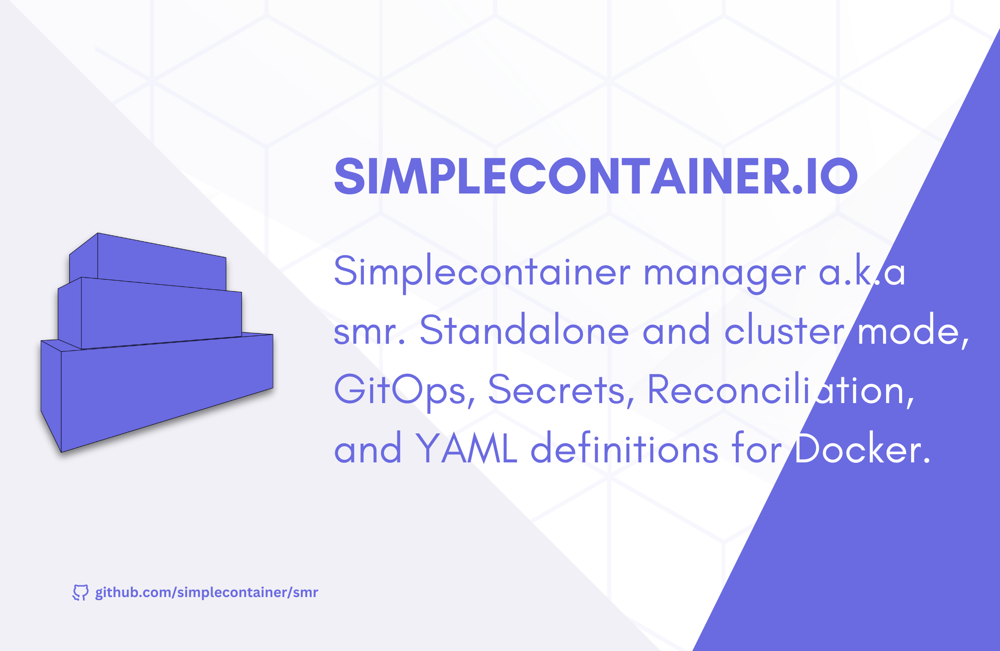

Quick start
===========

> [!IMPORTANT]
> The project is not stable yet. Releases and major changes are introduced often. 

Would you like to apply docker to various remote daemons, as you can for k8s? Well:
```cgo
smr apply https://raw.githubusercontent.com/simplecontainer/examples/refs/heads/main/tests/minimal-cluster/definition.yaml
smr ps
NODE             GROUP    NAME     DOCKER NAME        IMAGE           IP                    PORTS  DEPS  ENGINE STATE      SMR STATE     
smr-agent-2 (2)  example  busybox  example-busybox-2  busybox:latest  10.10.42.3 (cluster)  -      -     running (docker)  running (1s)  
smr-agent-1 (1)  example  busybox  example-busybox-1  busybox:latest  10.10.42.2 (cluster)  -      -     running (docker)  running (1s)  
```

Voila! This is a quick start tutorial for how you can do just that

These containers are running on different nodes and are connected via flannel with encrypted overlay network! Cool? We think so too.
To explore more dive into this README.md.
## What is simplecontainer?
### Architecture


### Introduction
The simplecontainer manager is designed to ease life for the developers and DevOps engineers running containers on Docker.

**It runs as container on top of container engine: docker supported only currently. It requires privilleges over container engine socket.
Afterward, it exposes API for container manipulation and orchestration.**

The simplecontainer introduces the following:

- Cluster of Docker daemons or single Docker daemon
- Overlay networking for containers using flannel (encrypted using wireguard by default)
- Integrated DNS server isolated from Docker daemon
- GitOps: deploy objects from the Git repositories using GitOps approach
- Replication of containers in cluster of Docker daemons
- Reconciliation and tracking the lifecycle of the Docker containers
- Reliable dependency ordering using readiness probes
- Recreate containers from the KV store in case of failure
- Templating of the container objects to leverage secrets and configuration
- Secrets, Configuration and Resources objects for external configuration
- CLI to interact with the simplecontainer
- Fast learning curve - simplicity and deterministic behavior

> [!IMPORTANT]
> To use flannel wireguard network encryption wireguard package needs to be installed on the machine running simplecontainer.
> See more at: https://www.wireguard.com/install/


Installation
--------------------------

### Using smrmgr
The smrmgr is bash script for management of the simplecontainer. It is used for:
- Downloading and installing client
- Starting the node in single or cluster mode
- Starting the node and joining to the existing cluster
- Various options and configuration simplified

```bash
curl -sL https://raw.githubusercontent.com/simplecontainer/smr/refs/heads/main/scripts/production/smrmgr.sh -o smrmgr
chmod +x smrmgr
sudo mv smrmgr /usr/local/bin
sudo smrmgr install
```

### Using smr
The smr is client used to communicate to the local/external simplecontainer agents running on nodes.
The smrmgr automatically downloads the client and places it under `/usr/local/bin/smr`.

To manually install, start and manage simplecontainer nodes download the client from the releases:

https://github.com/simplecontainer/client/releases

```bash
LATEST_VERSION=$(curl -s https://raw.githubusercontent.com/simplecontainer/client/main/version)
PLATFORM=linux-amd64
curl -o client https://github.com/simplecontainer/client/releases/download/$VERSION/client-$PLATFORM
sudo mv client /usr/local/bin/smr
```

Explore `/scripts/production/smrmgr.sh` to see how you can utilize smr client to configure and start simplecontainer nodes.

## Running simplecontainer
Simplecontainer can run in single and cluster mode. Cluster mode allows users to deploy Docker daemons on different hosts and connect them via simplecontainer. An overlay network is created using flannel to enable inter-host communication.

Simplecontainer uses RAFT protocol to enable distributed state using the Badger key-value store.
Etcd embedded is also started in single mode and exposed to localhost only without credentials. Flannel uses only Etcd as the state store for the network configuration.

Control-plane and RAFT communication is secured using mTLS so data is encrypted even over non-secure underlying networks.

Ports exposed:
- `0.0.0.0:1443->1443/tcp` (Simplecontainer control plane)
- `0.0.0.0:9212->9212/tcp` (RAFT protocol control plane sharing state)
- `:::1443->1443/tcp` (Simplecontainer control plane ipv6)
- `127.0.0.1:2379->2379/tcp` (Etcd exposed only on the localhost)


### Single node mode
The simplecontainer can also be run as a single node without clustering enabled and additional overhead if it is not mandatory to have multiple nodes, high availability, and disaster recovery in place for the application.

The control plane can be exposed:
- On the localhost only to prevent control plane communication from being done outside localhost
- On the 0.0.0.0:1443 which means all interfaces that include all endpoints localhost or from another network.

#### How to run it? (Control plane exposed to all networks)
Exposing the control plane to the `0.0.0.0:1443` and `smr.example.com` will be only valid domain for the certificate authentication (**Change domain to your domain**):
```bash
smrmgr start -a smr-agent-1 -d smr.example.com
# Copy the content of the export
smr context export <<< https://smr.example.com:1443
# Copy the decryption key
cat $HOME/smr/smr/contexts/$(smr context).key
```

On the external machine run:
```bash
smr context import {{ PASTE CONTEXT }} <<< {{ PASTE KEY }}
smr ps
```

#### How to run it? (Control plane exposed to the localhost only)
Exposing the control plane only to the localhost:

```bash
smrmgr start -a smr-agent-1 -e localhost:1443
```

Now the contorl plane is accesible from the localhost.

```bash
smr ps
NODE  GROUP  NAME  DOCKER NAME  IMAGE  IP  PORTS  DEPS  ENGINE STATE  SMR STATE  
```

### Cluster mode
#### How to run it? (Production cluster with public domains)

> [!IMPORTANT]
> The smrmgr script must be run on the host directly.

This scenario assumes there are two nodes(virtual machines) connected over a non-secure internet connection.

- `Node 1`: `node1.simplecontainer.com` -> `Points to Node 1 IP address`
- `Node 2`: `node2.simplecontainer.com` -> `Points to Node 2 IP address`

**Node 1**
Requirements: 
- smgrmgr already installed.
- Docker daemon running on the Node 1

```bash
smrmgr start -a smr-agent-1 -d smr1.example.com
# Copy the content of the export
smrmgr export https://node1.example.com:1443
# Copy the decryption key
cat $HOME/smr/smr/contexts/$(smr context).key
```

**Node 2 (And any other nodes joining cluster)**
Requirements:
- The smgrmgr already installed
- The docker daemon running on the Node 2

```bash
smrmgr import {{ PASTE CONTEXT }} <<< {{ PASTE KEY }}
smr context fetch
smrmgr start -a smr-agent-2 -d smr2.example.com -j smr1.example.com:1443
```

Afterward, the cluster is started. Flannel will start and the agent will create a docker network named cluster. 

To connect containers with cluster network in the container definition specify that you want the container to connect to the cluster network.

## How to manipulate containers?
The simplecontainer introduces objects which can be defined as YAML definition and sent to the simplecontainer manager to produce containers on the engine via reconciliation:

- Containers
- Container
- Configuration
- Resource
- Gitops
- CertKey
- HttpAuth

These objects let you deploy containers on local/remote Docker daemon.

## Running Docker containers (GitOps approach)


It is possible to keep definition YAML files in the repository and let the simplecontainer apply it from the repository - a.k.a GitOps.

```bash
smr apply https://raw.githubusercontent.com/simplecontainer/examples/refs/heads/main/tests/gitops/apps/gitops-plain.yaml
```

Applying this definition will create GitOps object on the simplecontainer.

```bash
smr gitops list
GROUP     NAME          REPOSITORY                                             REVISION  SYNCED        AUTO   STATE    
examples  plain-manual  https://github.com/simplecontainer/examples (cb849c3)  main      cb849c3       false  InSync  

smr gitops sync test smr

smr ps 
GROUP    NAME     DOCKER NAME        IMAGE           IP  PORTS  DEPS  DOCKER STATE  SMR STATE         
example  busybox  example-busybox-1  busybox:latest                   running       running (50m40s)  
example  busybox  example-busybox-2  busybox:latest                   running       running (50m40s)  
```

In this example, auto sync is disabled and needs to be triggered manually. When triggered the reconciler will apply 
all the definitions in the `/tests/minimal` directory from the `https://github.com/simplecontainer/examples` repository.

To see more info about the Gitops object:

```bash
smr gitops get examples plain-manual
```

Output:

```json
{
  "gitops": {
    "meta": {
      "group": "examples",
      "name": "plain-manual"
    },
    "spec": {
      "API": "",
      "automaticSync": false,
      "certKeyRef": {
        "Group": "",
        "Name": ""
      },
      "context": "",
      "directory": "/tests/minimal",
      "httpAuthRef": {
        "Group": "",
        "Name": ""
      },
      "poolingInterval": "",
      "repoURL": "https://github.com/simplecontainer/examples",
      "revision": "main"
    }
  },
  "kind": "gitops"
}
```

## Running containers (Applying definitions approach)

This scenario assumes two nodes of simplecontainer running.

Run the next commands:
```bash
smr secret create secret.mysql.mysql.password 123456789
smr apply https://raw.githubusercontent.com/simplecontainer/examples/main/tests/dependency-readiness-simple/mysql-config.yaml
smr apply https://raw.githubusercontent.com/simplecontainer/examples/main/tests/dependency-readiness-simple/mysql-envs.yaml
smr apply https://raw.githubusercontent.com/simplecontainer/examples/main/tests/dependency-readiness-simple/nginx-config.yaml
smr apply https://raw.githubusercontent.com/simplecontainer/examples/main/tests/dependency-readiness-simple/traefik-config.yaml
smr apply https://raw.githubusercontent.com/simplecontainer/examples/main/tests/dependency-readiness-simple/containers.yaml
```

This example demonstrates:
- configuration
- resource
- container
- readiness check
- dependency

After running commands above, check the `smr ps`:
```bash
smr ps
NODE             GROUP    NAME     DOCKER NAME        IMAGE         IP                   PORTS                      DEPS      ENGINE STATE      SMR STATE                  
smr-agent-1 (1)  mysql    mysql    mysql-mysql-1      mysql:8.0                          3306                       -         running (docker)  running  (36s)          
smr-agent-2 (2)  mysql    mysql    mysql-mysql-2      mysql:8.0                          3306                       -         running (docker)  running  (36s)          
smr-agent-2 (2)  nginx    nginx    nginx-nginx-1      nginx:1.23.3                       80, 443                    mysql.*   running (docker)  running  (36s)          
smr-agent-2 (2)  traefik  traefik  traefik-traefik-1  traefik:v2.5  172.17.0.7 (bridge)  80:80, 443:443, 8888:8080  mysql.*   running (docker)  running  (36s)  
```

Containers from group mysql will start first. 

Traefik and nginx will wait till mysql is ready because of the dependency definition and ordering.

Important links
---------------------------
- https://simplecontainer.io
- https://quay.io/repository/simplecontainer/smr
- https://github.com/simplecontainer/smr
- https://github.com/simplecontainer/client
- https://github.com/simplecontainer/examples

# License
This project is licensed under the GNU General Public License v3.0. See more in LICENSE file.