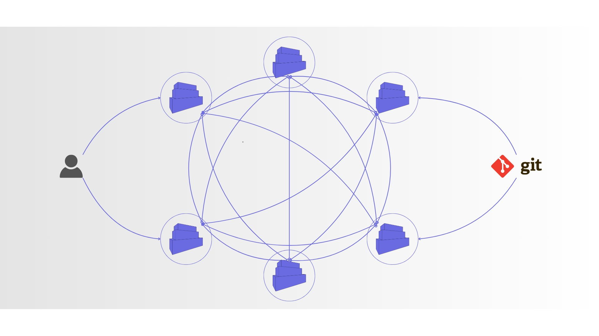

Introduction
===========

> [!IMPORTANT]
> The project is alpha.

## Quickstart
### Prerequisite
To turn docker daemon into simplecontainer node:
- Docker must be already installed (https://docs.docker.com/engine/install/)

### Running node with default config
To run container node with default config:

```bash
curl -sL https://raw.githubusercontent.com/simplecontainer/smr/refs/heads/main/scripts/production/smrmgr.sh -o smrmgr
chmod +x smrmgr
sudo mv smrmgr /usr/local/bin  # places smrmgr and smrctl under /usr/bin/local
sudo smrmgr install # places smr and smrctl under /usr/bin/local
```

Now that tools are installed, to run default node just execute:

```bash
smrmgr start # Requires sudo permissions to start flannel networking
```

After node is started import context for the smrctl and use smrctl to talk using control plane.

```bash
smrctl import $(sudo smr agent export --api localhost:1443)
smrctl ps
```

If you want to run on some another domain just replace localhost with the domain.

Simplecontainer runs as a docker container with access to the docker daemon socket and takes over orchestration.
It let's you define YAML files with state you want and after applying the node reconcile to the defined state.

It works as an overlay over docker daemon and
providing API for orchestrating containers and additional resources like configuration, secret, etc. 

Simplecontainer runs as container itself with the access to the /var/run/docker.sock to orchestrate containers.

mTLS is used to authenticate the clients and security is on high level.

In practice, it would look like this:
```cgo
smrctl apply https://raw.githubusercontent.com/simplecontainer/examples/refs/heads/main/tests/minimal/definitions/Containers.yaml
smrctl ps
NODE         RESOURCE                              PORTS  DEPS  ENGINE STATE      SMR STATE     
smr-agent-2  containers/example/example-busybox-1  -      -     running (docker)  running (9s)  
```

The goals are to make mangement of docker containers on VMs, On-prem servers, or thrifty machines as stable and manageable
resources for business operations. It can standardize deployment procedure without using different glues to make deployments.
Turning docker daemon into simplecontainer node is matter of seconds.

Simplecontainer can manage next scenarios:
- Running one simplecontainer node for one docker daemon
- Running multiple simplecontainer nodes for multiple docker daemons where every node is isolated
- Running multiple simplecontainer nodes for multiple docker daemons where nodes are in cluster

To explore more dive into this README.md.
## Architecture
You can run single node, multiple single nodes, or multiple nodes in cluster. Simplecontainer relies on etcd, RAFT and flannel to enable cluster of docker daemons.

The etcd is started in the single instance mode, embedded in the simplecontainer itself. RAFT protocol is used to enable multi
node architecture, also embeded in the simplecontainer - not to be confused with cluster of etcd nodes. 
Flannel is used to configure overlay network so that each container can reach other containers in the cluster.

Flannel can be configured in multiple ways as flannel itself supports multiple backends. Default backend for simplecontainer is wiregurad
since it is secure by default and overlay communication is encrypted over non-secure networks.

> [!IMPORTANT]
> To use flannel wireguard network encryption wireguard package needs to be installed on the machine running simplecontainer.
> See more at: https://www.wireguard.com/install/

In the simple terms the simplecontainer works similar as git where every instance holds copy of all state information.
### Introduction
The simplecontainer manager is designed to ease life for the developers and DevOps engineers running containers on Docker.

**It runs as container on top of container engine: docker supported only currently. It requires privilleges over container engine socket.
Afterward, it exposes API for container manipulation and orchestration.**

The simplecontainer introduces the following:

- Overlay networking for containers using flannel (encrypted using wireguard by default)
- Integrated DNS server isolated from Docker daemon
- GitOps: deploy containers on Docker using GitOps pattern
- Replication of containers in cluster of Docker daemons
- Reconciliation and tracking the lifecycle of the Docker containers
- Reliable dependency ordering using readiness probes
- Server side templating of the container objects to leverage secrets, configuration, and resources
- Secrets, Configuration and Resources objects for external configuration
- CLI to interact with the simplecontainer
- Fast learning curve - simplicity and deterministic behavior
- UI dashboard for better overview with real-time updates

Installation
--------------------------

### Using smrmgr
The smrmgr is bash script for management of the simplecontainer. It is used for:
- Downloading and installing client
- Starting the node in single or cluster mode
- Starting the node and joining to the existing cluster
- Various options and configuration simplified

```bash
curl -sL https://raw.githubusercontent.com/simplecontainer/smr/refs/heads/main/scripts/production/smrmgr.sh -o smrmgr
chmod +x smrmgr
sudo mv smrmgr /usr/local/bin  # places smrmgr and smrctl under /usr/bin/local
sudo smrmgr install # places smr and smrctl under /usr/bin/local
```
The smrmgr automatically downloads the smr and smrctl binaryies and places them under `/usr/local/bin`.
Explore `/scripts/production/smrmgr.sh` to see how you can utilize smr client to configure and start simplecontainer nodes.

## Running simplecontainer
Simplecontainer can run in single and cluster mode. Cluster mode allows users to deploy Docker daemons on different hosts and connect them via simplecontainer. An overlay network is created using flannel to enable inter-host communication.

Simplecontainer uses RAFT protocol to enable distributed state using the Badger key-value store.
Etcd embedded is also started in single mode and exposed to localhost only without credentials. Flannel uses only Etcd as the state store for the network configuration.

Control-plane and RAFT communication is secured using mTLS so data is encrypted even over non-secure underlying networks.

Ports exposed:
- `0.0.0.0:1443->1443/tcp` (Simplecontainer control plane)
- `0.0.0.0:9212->9212/tcp` (RAFT protocol control plane sharing state)
- `:::1443->1443/tcp` (Simplecontainer control plane ipv6)
- `127.0.0.1:2379->2379/tcp` (Etcd exposed only on the localhost)


### Single node mode
The simplecontainer can also be run as a single node without clustering enabled and additional overhead if it is not mandatory to have multiple nodes, high availability, and disaster recovery in place for the application.

The control plane can be exposed:
- On the localhost only to prevent control plane communication from being done outside localhost
- On the 0.0.0.0:1443 which means all interfaces that include all endpoints localhost or from another network.

#### How to run it? (Control plane exposed to all interfaces)
Exposing the control plane to the `0.0.0.0:1443` and `smr.example.com` will be only valid domain for the certificate authentication (**Change domain to your domain**):
```bash
smrmgr start -d smr.example.com
sudo smr agent export --api smr.example.com:1443
```

On the external machine run:
```bash
smrctl import PASTE_OUTPUT_HERE
smrctl ps
```

### Cluster mode
#### How to run it? (Production cluster with public domains)

> [!IMPORTANT]
> The smrmgr script must be run on the host directly.

This scenario assumes there are two nodes(virtual machines) connected over a non-secure internet connection.

- `Node 1`: `node1.simplecontainer.com` -> `Points to Node 1 IP address`
- `Node 2`: `node2.simplecontainer.com` -> `Points to Node 2 IP address`

**Node 1**
Requirements: 
- smgrmgr already installed.
- Docker daemon running on the Node 1

```bash
smrmgr start -n simplecontainer-1 -d smr-1.example.com
smr agent export --api smr.example.com:1443
```

**Node 2 (And any other nodes joining cluster)**
Requirements:
- The smgrmgr already installed
- The docker daemon running on the Node 2

```bash
smr agent import --node simplecontainer-2 -y PASTE_EXPORTED_OUTPUT
smrmgr start -n simplecontainer-2 -d smr-2.example.com -j -p smr-1.example.com
```

Afterward, the cluster is started. Flannel will start and the agent will create a docker network named cluster.
## How to manipulate containers?
The simplecontainer introduces objects which can be defined as YAML definition and sent to the simplecontainer manager to produce containers on the engine via reconciliation:

- Containers
- Configuration
- Resource
- Gitops
- CertKey
- HttpAuth

These objects let you deploy and configure containers on local/remote Docker daemon.

## Running Docker containers (GitOps approach)

It is possible to keep definition YAML files in the repository and let the simplecontainer apply it from the repository - a.k.a GitOps.

```bash
smr apply https://raw.githubusercontent.com/simplecontainer/examples/refs/heads/main/tests/gitops-apps/definitions/gitops-plain.yaml
```

Applying this definition will create GitOps object on the simplecontainer.

```bash
smrctl ps gitops
RESOURCE                      REPOSITORY                                             REVISION  SYNCED        AUTO   STATE    STATUS              
gitops/examples/plain-manual  https://github.com/simplecontainer/examples (2fbe408)  main      Never synced  false  Drifted  drifted
```

Since auto sync is disabled - sync must be triggered by the user.

```bash
smrctl sync gitops/examples/plain-manual
smrctl ps
NODE         RESOURCE                              PORTS  DEPS  ENGINE STATE      SMR STATE         
smr-agent-2  containers/example/example-busybox-1  -      -     running (docker)  running (29m24s)  
smr-agent-2  containers/example/example-busybox-2  -      -     running (docker)  running (29m25s)
```
In this example, auto sync is disabled and needs to be triggered manually. When triggered the reconciler will apply 
all the definitions in the `/tests/minimal` pack from the `https://github.com/simplecontainer/examples` repository.

To see more info about the Gitops object:

```bash
smr get gitops/examples/plain-manual
```
Output:

```json
{
  "kind": "gitops",
  "prefix": "simplecontainer.io/v1",
  "meta": {
    "group": "examples",
    "name": "plain-manual",
    "runtime": {
      "owner": {
        "Kind": "",
        "Group": "",
        "Name": ""
      },
      "node": 2,
      "nodeName": "smr-agent-2"
    }
  },
  "spec": {
    "repoURL": "https://github.com/simplecontainer/examples",
    "revision": "main",
    "directoryPath": "/tests/minimal",
    "poolingInterval": "",
    "automaticSync": false,
    "API": "",
    "context": "",
    "certKeyRef": {
      "Prefix": "",
      "Group": "",
      "Name": ""
    },
    "httpAuthRef": {
      "Prefix": "",
      "Group": "",
      "Name": ""
    }
  },
  "state": {
    "Gitops": {
      "Synced": false,
      "Drifted": false,
      "Missing": false,
      "NotOwner": false,
      "Error": false,
      "State": "",
      "Messages": null,
      "Commit": [
        0,
        0,
        0,
        0,
        0,
        0,
        0,
        0,
        0,
        0,
        0,
        0,
        0,
        0,
        0,
        0,
        0,
        0,
        0,
        0
      ],
      "Changes": null,
      "LastSync": "0001-01-01T00:00:00Z"
    },
    "Options": []
  }
}
```

## Running containers (Applying definitions approach)

This scenario assumes two nodes of simplecontainer running.

Run the next commands:
```bash
git clone https://github.com/simplecontainer/examples
smrctl apply examples/tests/dependency-readiness-simple 
object applied: resource
object applied: configuration
object applied: configuration
object applied: secret
object applied: containers
object applied: resource
object applied: containers
object applied: resource
object applied: containers
```

This example demonstrates:
- secrets
- configuration
- resource
- container
- readiness check
- dependency

After running commands above, check the `smrctl ps`:
```bash
smrctl ps
NODE         RESOURCE                              PORTS                      DEPS      ENGINE STATE      SMR STATE              
smr-agent-2  containers/example/example-busybox-1  -                          -         running (docker)  running (32m55s)       
smr-agent-2  containers/example/example-busybox-2  -                          -         running (docker)  running (32m55s)       
smr-agent-1  containers/mysql/mysql-mysql-1        3306                       -         running (docker)  readiness_check (1s)   
smr-agent-2  containers/nginx/nginx-nginx-1        80, 443                    mysql.*   -                 depends_checking (1s)  
smr-agent-2  containers/nginx/nginx-nginx-2        80, 443                    mysql.*   -                 depends_checking (1s)  
smr-agent-2  containers/traefik/traefik-traefik-1  80:80, 443:443, 8888:8080  mysql.*   -                 depends_checking (1s)
```

Containers from group mysql will start first. 

Traefik and nginx will wait till mysql is ready because of the dependency definition and ordering.

Important links
---------------------------
- https://app.simplecontainer.io
- https://docs.simplecontainer.io
- https://blog.simplecontainer.io
- https://quay.io/repository/simplecontainer/smr
- https://github.com/simplecontainer/smr
- https://github.com/simplecontainer/examples

# License
This project is licensed under the GNU General Public License v3.0. See more in LICENSE file.