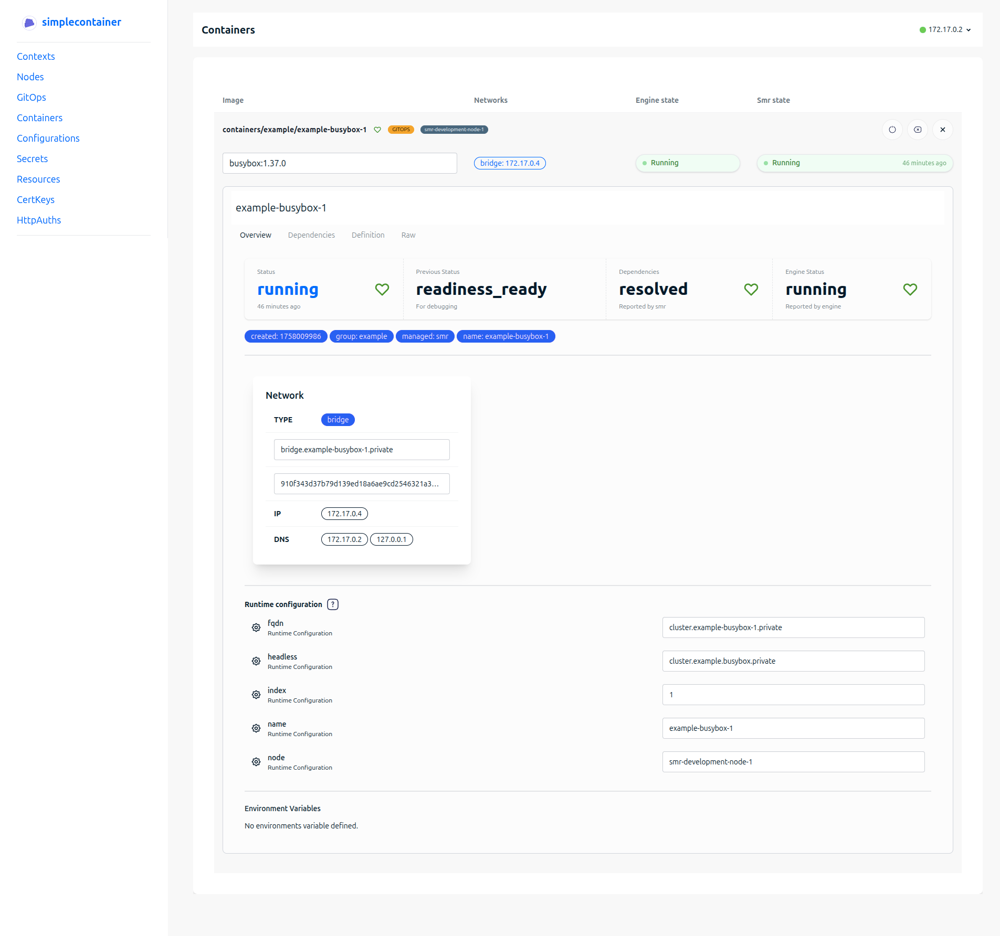
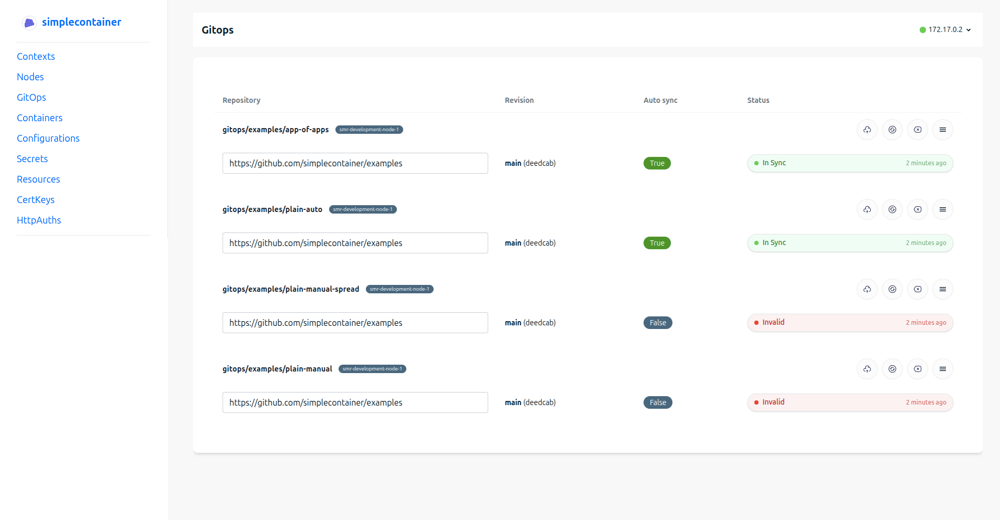

# Simplecontainer
[](https://www.bestpractices.dev/projects/10512)


> [!IMPORTANT]
> This project is currently in **alpha** stage. Use with caution in production environments.

## Overview

Simplecontainer is a container orchestration platform that transforms Docker daemons into managed nodes with GitOps capabilities. It provides enterprise-grade features like overlay networking, secrets management, and multi-node clustering while maintaining the simplicity of Docker.

### Key Features

- **GitOps Deployment**: Deploy containers using Git repositories as the source of truth
- **Bidirectional GitOps Controller**: Gitops controller enables interface for applying patches to the git
- **Overlay Networking**: Secure container communication using Flannel with WireGuard encryption
- **Multi-Node Clustering**: Scale across multiple Docker daemons with RAFT consensus
- **Dependency Management**: Reliable container startup ordering with readiness probes
- **Secrets & Configuration**: Built-in secret and configuration management
- **mTLS Security**: Encrypted control plane communication
- **Real-time Dashboard**: Web UI for monitoring and management

## Quick Start

### Prerequisites

- Docker installed and running ([Installation Guide](https://docs.docker.com/engine/install/))
- For WireGuard networking: WireGuard package ([Installation Guide](https://www.wireguard.com/install/))

### Installation

1. **Download and install tooling(smrmgr.sh, smr, and smrctl):**

```bash
curl -sL https://raw.githubusercontent.com/simplecontainer/smr/refs/heads/main/scripts/production/smrmgr.sh -o smrmgr
chmod +x smrmgr
sudo mv smrmgr /usr/local/bin
sudo smrmgr install
```

2. **Start a single node with default configuration:**

```bash
smrmgr start
```

3. **Configure the CLI client:**

```bash
smrctl context import $(smr agent export) -y
smrctl ps
```

### Running dashboard

After starting node, dashboard can be started on the local machine.

Dashboard comes as container package (Pack) that makes running it easy. You can use the already available Dashboard pack to install it and run it directly on the Simplecontainer node.

### Localhost
Add these to /etc/hosts file:

```
127.0.0.1 authentik.dashboard.localhost
127.0.0.1 proxy.dashboard.localhost
127.0.0.1 api.dashboard.localhost
127.0.0.1 dashboard.localhost
```

After that run:

```
git clone https://github.com/simplecontainer/dashboard-pack.git
mkcert dashboard.localhost proxy.dashboard.localhost api.dashboard.localhost authentik.dashboard.localhost
smrctl apply dashboard-pack --set user=$USER --set traefik.certificate="$(cat dashboard.localhost+3.pem)" --set traefik.key="$(cat dashboard.localhost+3-key.pem)"
```

That's it. This pack runs:

- Authentik
- Postgres
- Traefik
- Dashboard
- Proxy-manager

- Just access https://dashboard.locahost and you should see the login form.

> [!IMPORTANT]
> ⚠️️ Authentik user needs to be setup first. Visit https://authentik.dashboard.localhost/if/flows/initial-setup to create an admin user.

After applying dashboard pack, success of the deployment can be verified:

```
smrctl ps
NODE                    RESOURCE                                            IMAGE                                                      PORTS                 ENGINE STATE      SMR STATE     
smr-development-node-1  containers/authentik/authentik-authentik-worker-1   ghcr.io/goauthentik/server:latest (pulled)                 -                     running (docker)  running (1s)  
smr-development-node-1  containers/authentik/authentik-authentik-1          ghcr.io/goauthentik/server:latest (pulled)                 9000                  running (docker)  running (1s)  
smr-development-node-1  containers/authentik/authentik-pg-1                 postgres:15 (pulled)                                       -                     running (docker)  running (1s)  
smr-development-node-1  containers/authentik/authentik-redis-1              redis:alpine (pulled)                                      -                     running (docker)  running (1s)  
smr-development-node-1  containers/dashboard/dashboard-dashboard-oss-1      quay.io/simplecontainer/dashboard-oss:latest (pulled)      3000                  running (docker)  running (1s)  
smr-development-node-1  containers/dashboard/dashboard-proxy-manager-oss-1  quay.io/simplecontainer/proxy-manager-oss:latest (pulled)  5443, 5480            running (docker)  running (1s)  
smr-development-node-1  containers/traefik/traefik-traefik-1                traefik:v3.5.0 (pulled)                                    80:80, 443:443, 8080  running (docker)  running (1s)  
```





### Deploy First Container

Deploy a basic container definition on Docker using simplecontainer:

```bash
smrctl apply https://raw.githubusercontent.com/simplecontainer/examples/refs/heads/main/tests/minimal/definitions/Containers.yaml
smrctl ps
```

Expected output:
```
NODE                    RESOURCE                              PORTS  DEPS  ENGINE STATE      SMR STATE     
simplecontainer-node-1  containers/example/example-busybox-1  -      -     running (docker)  running (9s)  
```

## Architecture

Simplecontainer supports three deployment modes:

1. **Single Node**: Standalone Docker daemon management
2. **Multiple Isolated Nodes**: Independent Simplecontainer instances
3. **Clustered Nodes**: Distributed container orchestration

### Core Components

- **Control Plane**: REST API for container management (port 1443)
- **RAFT Consensus**: Distributed state management (port 9212)
- **Embedded etcd**: Local key-value store (port 2379, localhost only)
- **Flannel Networking**: Overlay network with WireGuard encryption
- **DNS Server**: Isolated DNS resolution for containers

## Deployment Modes

### Single Node Deployment

#### Localhost Access Only
```bash
smrmgr start
```

#### External Access
Replace `smr.example.com` with your domain:

```bash
smrmgr start -d smr.example.com
smr agent export --api smr.example.com:1443
```

From external machines:
```bash
smrctl context import PASTE_EXPORTED_CONTEXT_HERE
smrctl ps
```

### Cluster Deployment

#### Node 1 (Cluster Leader)
```bash
smrmgr start -n simplecontainer-1 -d smr-1.example.com
smr agent export --api smr-1.example.com:1443
```

#### Node 2+ (Joining Nodes)
```bash
smr agent import --node simplecontainer-2 -y PASTE_EXPORTED_OUTPUT
smrmgr start -n simplecontainer-2 -d smr-2.example.com -j -p smr-1.example.com
```

## Container Management

Simplecontainer uses YAML definitions to manage containers and related resources:

### Core Objects

- **Containers**: Define container specifications
- **Configuration**: Application configuration management
- **Secrets**: Secure credential storage
- **Resources**: Shared resources between containers
- **GitOps**: Git-based deployment automation
- **CertKey**: TLS certificate management
- **HttpAuth**: HTTP authentication configuration

### GitOps Workflow

1. **Create GitOps definition:**

```bash
smrctl apply https://raw.githubusercontent.com/simplecontainer/examples/refs/heads/main/tests/gitops-apps/definitions/gitops-plain.yaml
```

2. **Check GitOps status:**

```bash
smrctl ps gitops
```

3. **Trigger synchronization:**

```bash
smrctl sync gitops/examples/plain-manual
```

4. **Verify deployment:**

```bash
smrctl ps
```

### Direct Application Deployment

For immediate deployment without GitOps:

```bash
git clone https://github.com/simplecontainer/examples
smrctl apply examples/tests/dependency-readiness-simple
```

This example demonstrates:
- Secret management
- Configuration handling
- Resource sharing
- Container dependencies
- Readiness checks

## Advanced Features

### Dependency Management

Containers can depend on other containers being ready:

```yaml
spec:
  dependencies:
    - mysql.*  # Wait for all mysql containers to be ready
```

### Readiness Probes

Ensure containers are ready before marking them as available:

```yaml
spec:
  readiness:
    - name: "mysql"
      timeout: "60s"
      command: ["mysqladmin", "ping", "-h", "localhost", "-p(( .password ))"]
```

### Server-Side Rendering

Use secrets and configuration in container definitions:

```yaml
spec:
  configuration:
      username: "root"
      password: (( lookup "secret/mysql/password:password" | base64decode ))
```

## Network Ports

- **1443**: Control plane API (TCP)
- **9212**: RAFT protocol communication (TCP)
- **2379**: Embedded etcd (localhost only)

## Command Reference

### Basic Commands

```bash
# List all containers
smrctl ps

# List specific resource types
smrctl ps gitops
smrctl ps secrets

# Get detailed information
smrctl get containers/example/busybox-1

# Apply definitions
smrctl apply <file_or_url>

# Sync GitOps resources
smrctl sync gitops/example/app

# Import/export contexts
smrctl context import <context_string>
smrctl context export
```

### Management Commands

```bash
# Start node
smrmgr start [options]

# Install tools
smrmgr install

# Export agent context
smr agent export --api <endpoint>

# Import agent context
smr agent import --node <name> -y <context>
```

## Troubleshooting

### Common Issues

1. **WireGuard not installed**: Install WireGuard package for secure networking
2. **Port conflicts**: Ensure ports 1443, 9212, and 2379 are available
3. **Docker socket access**: Simplecontainer needs access to `/var/run/docker.sock`
4. **Firewall**: Open required ports for cluster communication

### Logs and Debugging

```bash
# View container logs
smr node logs OR docker logs <simplecontainer_container_id>

# Verify cluster connectivity
smrctl ps
```

## Resources

- **Dashboard**: [app.simplecontainer.io](https://app.simplecontainer.io)
- **Documentation**: [docs.simplecontainer.io](https://docs.simplecontainer.io)
- **Blog**: [blog.simplecontainer.io](https://blog.simplecontainer.io)
- **Container Registry**: [quay.io/repository/simplecontainer/smr](https://quay.io/repository/simplecontainer/smr)
- **Source Code**: [github.com/simplecontainer/smr](https://github.com/simplecontainer/smr)
- **Dashboard**: [github.com/simplecontainer/smr](https://github.com/simplecontainer/dashboard)
- **Examples**: [github.com/simplecontainer/examples](https://github.com/simplecontainer/examples)

## Contributing

We welcome contributions! Please see our contributing guidelines and code of conduct.

## License

This project is licensed under the GNU General Public License v3.0. See the [LICENSE](LICENSE) file for details.